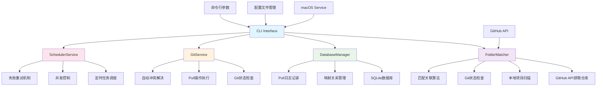
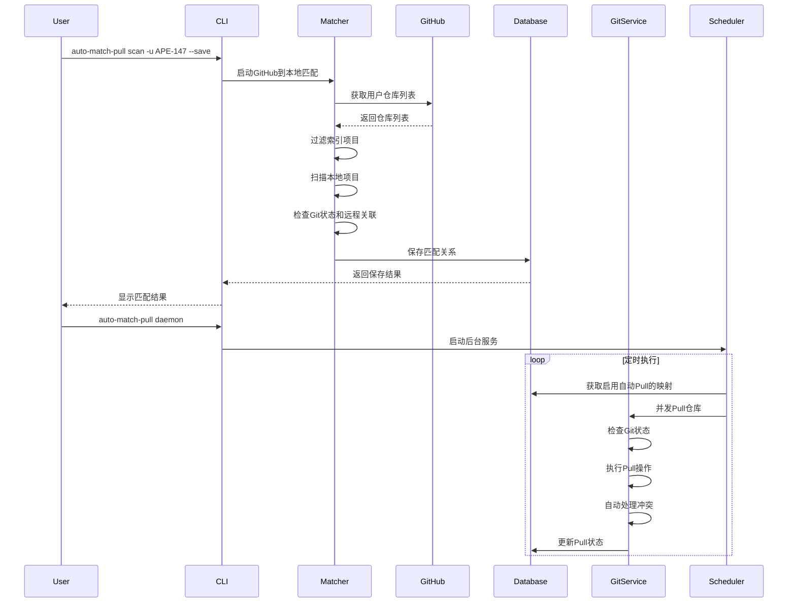

# Auto Match Pull

自动匹配文件夹和Git仓库并定时同步的工具。

## 项目架构图



## 功能流程图



## 功能特性

- 🔍 **GitHub集成**: 从GitHub API获取仓库列表，智能匹配本地项目
- 🗄️ **数据持久化**: 使用SQLite数据库保存匹配关系和同步状态
- ⏰ **定时同步**: 自动定时Pull所有匹配的Git仓库
- 🔧 **冲突解决**: 智能处理Git冲突，支持自动解决简单冲突
- 🖥️ **后台运行**: 支持macOS后台服务，开机自启动
- 📊 **状态监控**: 详细的日志记录和状态查看
- 🎯 **灵活配置**: 可配置的搜索路径、同步间隔等参数

## 安装

### 从源码安装

```bash
git clone https://github.com/APE-147/auto-match-pull.git
cd auto-match-pull
pip install -e .
```

### 从PyPI安装

```bash
pip install auto-match-pull
```

## 快速开始

### 1. 扫描GitHub仓库并匹配本地项目

```bash
# 扫描默认路径，需要提供GitHub用户名
auto-match-pull scan -u APE-147 --save

# 扫描指定路径
auto-match-pull scan ~/Developer ~/Projects -u APE-147 --save

# 使用GitHub令牌（避免API限制）
auto-match-pull scan -u APE-147 -t YOUR_GITHUB_TOKEN --save
```

### 2. 查看匹配结果

```bash
auto-match-pull list
```

### 3. 手动Pull所有仓库

```bash
auto-match-pull pull
```

### 4. 启动后台服务

```bash
auto-match-pull daemon
```

## 详细使用

### 命令行接口

```bash
# 查看帮助
auto-match-pull --help

# 扫描GitHub仓库并匹配本地项目
auto-match-pull scan [路径...] -u USERNAME [-t TOKEN] [--save]

# 列出所有映射
auto-match-pull list

# 执行Pull操作
auto-match-pull pull [映射ID]

# 启动/停止守护进程
auto-match-pull daemon [--stop]

# 管理配置
auto-match-pull config [--show|--edit|--reset]

# 查看日志
auto-match-pull logs [映射ID] [--limit N]
```

### 配置文件

配置文件位于: `~/.auto-match-pull/config.json`

```json
{
  "search_paths": [
    "~/Developer",
    "~/Documents",
    "~/Projects"
  ],
  "github_username": "APE-147",
  "scheduler": {
    "pull_interval_minutes": 30,
    "max_concurrent_pulls": 3,
    "retry_failed_after_minutes": 120,
    "cleanup_logs_days": 30
  },
  "similarity_threshold": 0.8,
  "auto_resolve_conflicts": true
}
```

### macOS后台服务

在macOS上，你可以将工具设置为后台服务，开机自启动：

```bash
# 安装服务
cd auto-match-pull/macos
./install.sh install

# 管理服务
./install.sh start    # 启动服务
./install.sh stop     # 停止服务
./install.sh restart  # 重启服务
./install.sh status   # 查看状态
./install.sh logs     # 查看日志
./install.sh clean    # 清理日志
```

## 工作原理

1. **GitHub仓库获取**: 首先从GitHub API获取指定用户的所有仓库列表
2. **索引项目过滤**: 排除Crawler、Default、Script、Trading这4个索引项目
3. **本地项目匹配**: 扫描本地目录，查找与GitHub仓库同名的项目
4. **Git状态检查**: 验证本地项目是否为Git仓库及是否已关联远程仓库
5. **数据存储**: 将匹配关系保存到SQLite数据库
6. **自动Pull启用**: 对已关联远程仓库的项目开启自动Pull
7. **定时同步**: 定时检查并Pull所有启用的仓库
8. **冲突处理**: 自动处理简单的合并冲突，优先保留远程版本

## 目录结构

```
auto-match-pull/
├── auto_match_pull/
│   ├── __init__.py
│   ├── cli.py                 # CLI接口
│   ├── core/
│   │   ├── __init__.py
│   │   ├── matcher.py         # 文件夹匹配逻辑
│   │   └── database.py        # 数据库管理
│   ├── services/
│   │   ├── __init__.py
│   │   ├── git_service.py     # Git操作服务
│   │   └── scheduler.py       # 定时任务服务
│   └── utils/
│       └── __init__.py
├── macos/
│   ├── com.ape147.auto-match-pull.plist
│   └── install.sh             # macOS服务安装脚本
├── setup.py
├── pyproject.toml
├── requirements.txt
└── README.md
```

## 开发

### 设置开发环境

```bash
git clone https://github.com/APE-147/auto-match-pull.git
cd auto-match-pull
pip install -e .[dev]
```

### 运行测试

```bash
pytest
```

### 代码格式化

```bash
black auto_match_pull/
```

### 类型检查

```bash
mypy auto_match_pull/
```

## 许可证

MIT License

## 贡献

欢迎提交Issue和Pull Request！

## 更新日志

### v1.0.0
- 初始版本
- 支持文件夹和Git仓库的自动匹配
- 支持定时Pull和冲突解决
- 支持macOS后台服务