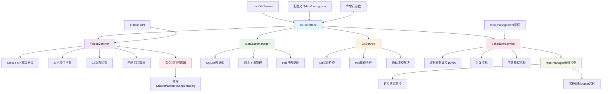
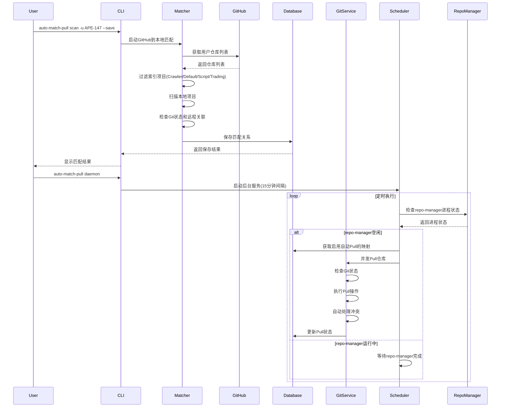

Auto Match Pull

自动匹配文件夹和Git仓库并定时同步的工具。

## ✨ 特性亮点

🛡️ **智能冲突解决** - 根据文件类型自动选择最佳合并策略，保护本地更改  
🔗 **依赖协调** - 与repo-management项目协调运行，避免冲突  
🧠 **智能过滤** - 自动排除索引仓库，专注于实际项目  
💾 **数据安全** - 自动stash保护，永不丢失本地修改  
⚙️ **高度可配置** - 灵活的策略配置，适应不同使用场景

## 🚀 快速开始

```bash
# 1. 安装
pip install -e .

# 2. 扫描并匹配仓库
auto-match-pull scan -u APE-147 --save

# 3. 启动后台服务（15分钟自动同步）
auto-match-pull daemon

# 4. 查看配置
auto-match-pull config --show
```

## 项目架构图



## 功能流程图



## 功能特性

- 🔍 **GitHub集成**: 从GitHub API获取仓库列表，智能匹配本地项目
- 🗄️ **数据持久化**: 使用SQLite数据库保存匹配关系和同步状态
- ⏰ **定时同步**: 自动定时Pull所有匹配的Git仓库(默认15分钟间隔)
- 🔗 **依赖协调**: 等待repo-management进程完成后再执行同步操作
- 🚫 **智能过滤**: 自动排除索引仓库(Crawler/Default/Script/Trading)
- 🛡️ **智能冲突解决**: 多策略冲突处理，保护本地更改
  - 🧠 **smart_merge**: 根据文件类型智能选择策略
  - 🤝 **keep_both**: 保留双方更改，添加清晰标记
  - 🏠 **keep_local**: 完全保留本地版本
  - 🌐 **keep_remote**: 完全保留远程版本
- 💾 **本地保护**: 自动stash未提交更改，Pull后恢复
- 🖥️ **后台运行**: 支持macOS后台服务，开机自启动
- 📊 **状态监控**: 详细的日志记录和状态查看
- 🎯 **灵活配置**: 可配置的搜索路径、同步间隔、冲突策略等参数

## 安装

### 从源码安装

```bash
git clone https://github.com/APE-147/auto-match-pull.git
cd auto-match-pull
pip install -e .
```

### 从PyPI安装

```bash
pip install auto-match-pull
```

## 快速开始

### 1. 扫描GitHub仓库并匹配本地项目

```bash
# 扫描默认路径，需要提供GitHub用户名
auto-match-pull scan -u APE-147 --save

# 扫描指定路径
auto-match-pull scan ~/Developer ~/Projects -u APE-147 --save

# 使用GitHub令牌（避免API限制）
auto-match-pull scan -u APE-147 -t YOUR_GITHUB_TOKEN --save
```

### 2. 查看匹配结果

```bash
auto-match-pull list
```

### 3. 手动Pull所有仓库

```bash
auto-match-pull pull
```

### 4. 启动后台服务

```bash
auto-match-pull daemon
```

## 详细使用

### 命令行接口

```bash
# 查看帮助
auto-match-pull --help

# 扫描GitHub仓库并匹配本地项目
auto-match-pull scan [路径...] -u USERNAME [-t TOKEN] [--save]

# 列出所有映射
auto-match-pull list

# 执行Pull操作
auto-match-pull pull [映射ID]

# 启动/停止守护进程
auto-match-pull daemon [--stop]

# 管理配置
auto-match-pull config [--show|--edit|--reset]

# 查看日志
auto-match-pull logs [映射ID] [--limit N]
```

### 配置文件

配置文件位于: `项目目录/data/config.json`

```json
{
  "search_paths": [
    "/Users/niceday/Developer/Code/Local/Script",
    "/Users/niceday/Developer/Cloud/Dropbox/-WorkSpace-/Code/Area/Project"
  ],
  "github_username": "APE-147",
  "scheduler": {
    "pull_interval_minutes": 15,
    "max_concurrent_pulls": 3,
    "retry_failed_after_minutes": 120,
    "cleanup_logs_days": 30,
    "repo_manager_dependency": true,
    "repo_manager_config_dir": "/Users/niceday/Developer/Code/Local/Script/desktop/repo-management/.repo-manager"
  },
  "similarity_threshold": 0.8,
  "auto_resolve_conflicts": true,
  "conflict_resolution_strategy": "smart_merge"
}
```

#### 配置说明

- `pull_interval_minutes`: Pull操作间隔(分钟)，默认15分钟
- `repo_manager_dependency`: 是否等待repo-manager进程完成，默认true
- `repo_manager_config_dir`: repo-manager配置目录路径
- `max_concurrent_pulls`: 最大并发Pull数量
- `retry_failed_after_minutes`: 失败重试间隔(分钟)
- `auto_resolve_conflicts`: 是否启用自动冲突解决，默认true
- `conflict_resolution_strategy`: 冲突解决策略，可选值:
  - `smart_merge`: 智能合并(推荐)
  - `keep_both`: 保留双方更改
  - `keep_local`: 保留本地版本
  - `keep_remote`: 保留远程版本

### macOS后台服务

在macOS上，你可以将工具设置为后台服务，开机自启动：

```bash
# 安装服务
cd auto-match-pull/macos
./install.sh install

# 管理服务
./install.sh start    # 启动服务
./install.sh stop     # 停止服务
./install.sh restart  # 重启服务
./install.sh status   # 查看状态
./install.sh logs     # 查看日志
./install.sh clean    # 清理日志
```

## 工作原理

1. **GitHub仓库获取**: 首先从GitHub API获取指定用户的所有仓库列表
2. **索引项目过滤**: 排除Crawler、Default、Script、Trading这4个索引项目
3. **本地项目匹配**: 扫描本地目录，查找与GitHub仓库同名的项目
4. **Git状态检查**: 验证本地项目是否为Git仓库及是否已关联远程仓库
5. **数据存储**: 将匹配关系保存到SQLite数据库
6. **自动Pull启用**: 对已关联远程仓库的项目开启自动Pull
7. **依赖检查**: 每次Pull前检查repo-manager进程是否空闲
8. **定时同步**: 定时检查并Pull所有启用的仓库(15分钟间隔)
9. **冲突处理**: 自动处理简单的合并冲突，策略为优先保留远程版本

### 依赖协调机制

为了避免与repo-management项目冲突，auto-match-pull采用了依赖协调机制:

- 在每次执行Pull操作前，检查repo-manager进程状态
- 如果repo-manager正在运行，等待其完成(最多30分钟)
- 只有在repo-manager空闲时才开始Pull操作
- 可通过配置文件的`repo_manager_dependency`开关控制此功能

### 冲突处理机制

项目采用智能的冲突处理策略来保护本地更改：

1. **本地更改保护**: 
   - Pull前自动stash未提交的本地更改
   - Pull完成后自动恢复stash内容

2. **多种冲突解决策略**:
   - `smart_merge` (默认): 根据文件类型智能选择策略
     - 配置文件(.json/.yaml等): 保留本地版本
     - 文档文件(.md/.txt等): 保留双方更改
     - 代码文件: 保留双方更改供review
   - `keep_both`: 保留双方更改，添加清晰的分隔符
   - `keep_local`: 完全保留本地版本
   - `keep_remote`: 完全保留远程版本

3. **安全机制**:
   - 可通过配置文件的`auto_resolve_conflicts`开关禁用自动解决
   - 可通过`conflict_resolution_strategy`配置解决策略
   - 无法自动解决的冲突会停止Pull操作并记录日志
   - 支持手动干预解决复杂冲突

**推荐配置**: 使用`smart_merge`策略，既保护本地配置又确保代码变更可追踪。

## 目录结构

```
auto-match-pull/
├── auto_match_pull/
│   ├── __init__.py
│   ├── cli.py                 # CLI接口
│   ├── core/
│   │   ├── __init__.py
│   │   ├── matcher.py         # 文件夹匹配逻辑
│   │   └── database.py        # 数据库管理
│   ├── services/
│   │   ├── __init__.py
│   │   ├── git_service.py     # Git操作服务
│   │   └── scheduler.py       # 定时任务服务
│   └── utils/
│       └── __init__.py
├── macos/
│   ├── com.ape147.auto-match-pull.plist
│   └── install.sh             # macOS服务安装脚本
├── setup.py
├── pyproject.toml
├── requirements.txt
└── README.md
```

## 开发

### 设置开发环境

```bash
git clone https://github.com/APE-147/auto-match-pull.git
cd auto-match-pull
pip install -e .[dev]
```

### 运行测试

```bash
pytest
```

### 代码格式化

```bash
black auto_match_pull/
```

### 类型检查

```bash
mypy auto_match_pull/
```

## 许可证

MIT License

## 贡献

欢迎提交Issue和Pull Request！

## 更新日志

### v1.0.0 (2024-07-11)

#### 🎉 核心功能
- ✨ 初始版本发布
- 🔍 支持GitHub仓库与本地项目的自动匹配
- ⏰ 支持定时Pull和冲突解决(默认15分钟间隔)
- 🖥️ 支持macOS后台服务

#### 🛡️ 智能冲突解决系统
- 🧠 **smart_merge**: 根据文件类型智能选择策略
  - 配置文件(.json/.yaml等): 保留本地版本
  - 文档文件(.md/.txt等): 保留双方更改
  - 代码文件: 保留双方更改供review
- 🤝 **keep_both**: 保留双方更改，添加清晰标记
- 🏠 **keep_local**: 完全保留本地版本
- 🌐 **keep_remote**: 完全保留远程版本
- 💾 **本地保护**: 自动stash未提交更改，Pull后恢复

#### 🔗 项目协调机制
- 🎯 repo-management依赖协调机制
- 🚫 自动排除索引仓库(Crawler/Default/Script/Trading)
- 📁 配置文件迁移至项目data目录
- 🔧 优化进程依赖检查和超时处理

#### ⚙️ 配置增强
- 📋 新增`conflict_resolution_strategy`配置选项
- 🛠️ 支持可配置的冲突解决策略
- 🔍 增强的错误处理和日志记录