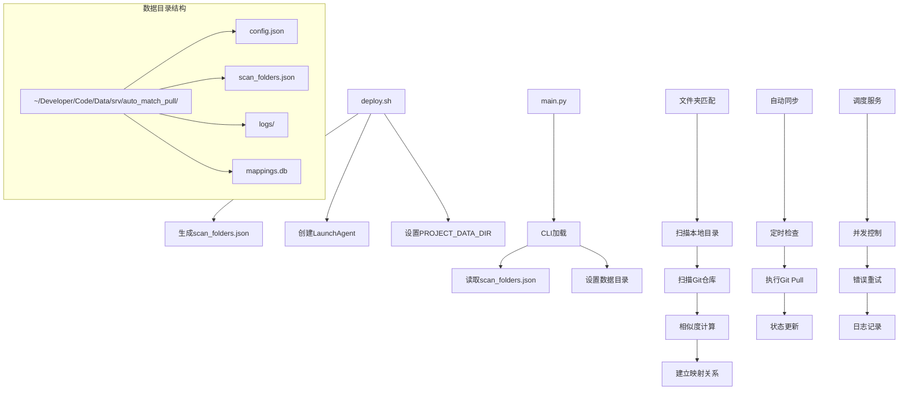
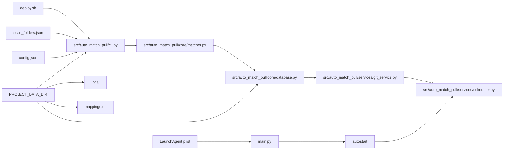

# Auto Match Pull System

## 功能实现原理



## 文件引用关系



## 部署说明

1. **运行部署脚本**：
   ```bash
   ./deploy.sh
   ```

2. **配置文件**：
   - `scan_folders.json`: 定义搜索路径和排除规则
   - `config.json`: 项目配置和调度设置

3. **数据目录**：
   - 位置：`~/Developer/Code/Data/srv/auto_match_pull/`
   - 包含：配置文件、映射数据库、日志

4. **服务管理**：
   - LaunchAgent 自动启动
   - 定时执行 Git Pull
   - 智能映射和冲突处理

## 新架构特性

- ✅ 使用 PROJECT_DATA_DIR 环境变量
- ✅ 符合新的文件结构规范
- ✅ 支持用户自定义扫描目录
- ✅ 规范化数据目录命名
- ✅ 统一的部署脚本模板